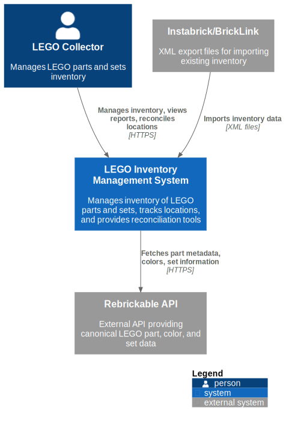
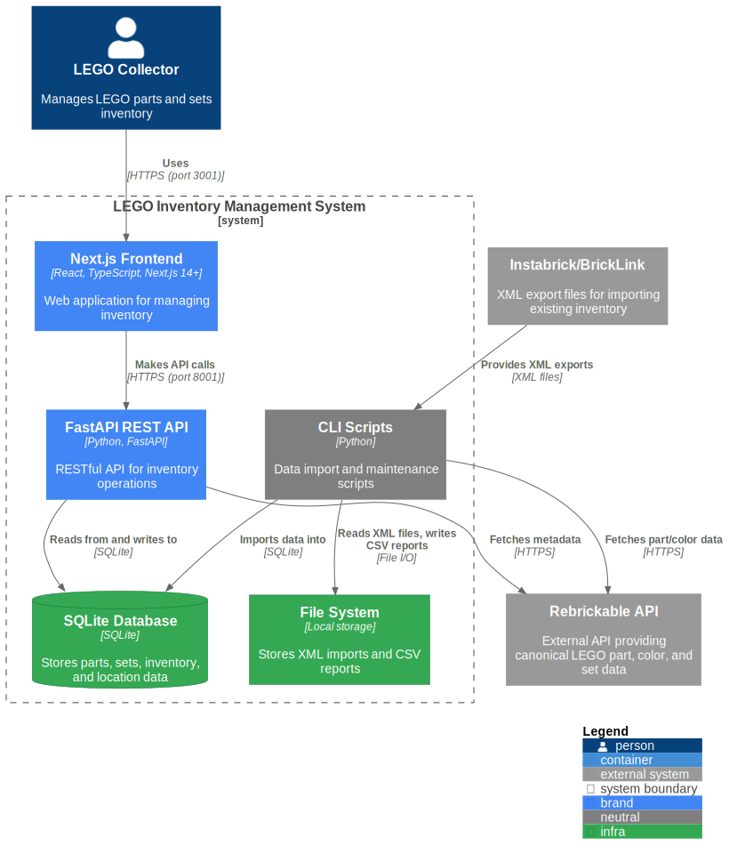
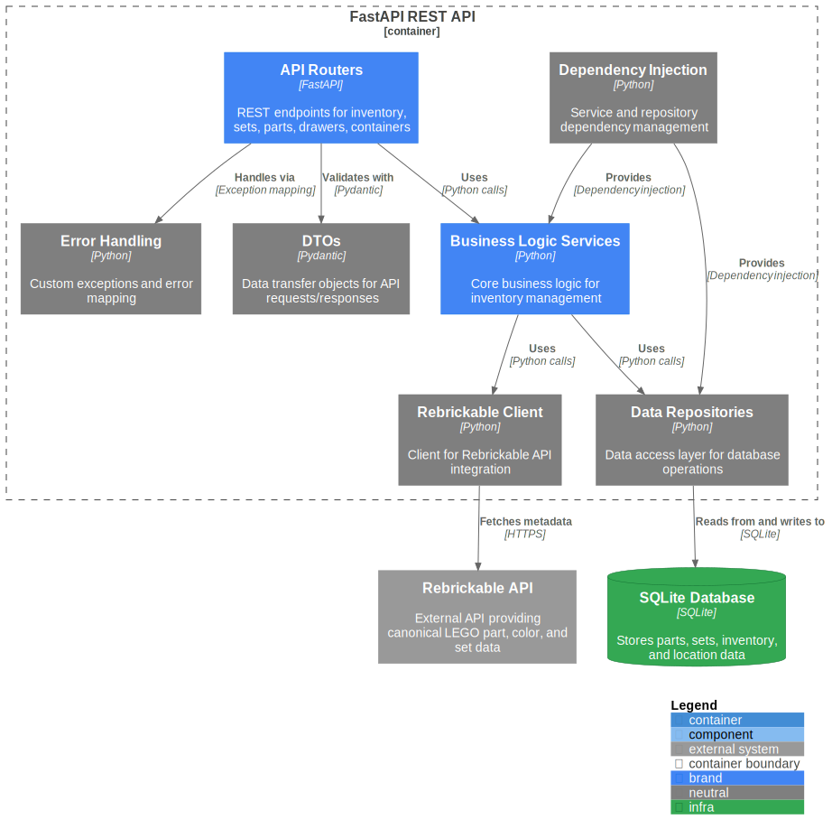

# LEGO Inventory Management System

A SQLite-backed inventory management system for LEGO parts and sets.  
Uses [Rebrickable](https://rebrickable.com/api/) as the canonical source and supports importing inventory from Instabrick/BrickLink XML exports.

---

## **Current Mode: Set-Centric Safe Mode (Soft Gating)**

When `APP_SAFE_MODE=true`, the app temporarily disables location-dependent features while the physical storage system is being rebuilt.

- **Enable (backend)**: set `APP_SAFE_MODE=true` (loaded via `src/app/settings.py`)
- **Enable (frontend)**: set `NEXT_PUBLIC_APP_SAFE_MODE=true` (recommended)
  - Client-side code can only read `NEXT_PUBLIC_*` env vars.
- **Behavior**:
  - **Backend**: legacy/location-dependent endpoints return **HTTP 410 (Gone)** with:
    - `{ "detail": "Temporarily disabled while physical storage system is being rebuilt." }`
  - **Frontend**: legacy nav items are hidden and legacy pages show a **“Temporarily disabled”** screen

---

## **Features**
- **Data import from Instabrick XML** with BrickLink → Rebrickable ID conversion  
- **Alias reconciliation** between BrickLink/Instabrick IDs and Rebrickable part & color IDs  
- **Full CRUD** for drawers, containers, sets, and loose parts inventory
- **Loose parts inventory management**:
  - Update part quantities in drawers/containers
  - Move parts between locations (with quantity control)
  - Delete parts from inventory
  - View loose parts by location with card and table views
- **Merge / move inventory** between locations  
- **Set management**:
  - Track multiple copies of a set
  - Store Rebrickable metadata (image, theme, year, etc.)
  - Set statuses: **Built**, **In Box**, **Work in Progress**, **Teardown**, **Loose Parts**
- **Part-out** a set into loose inventory
- **Move parts** between sets and loose inventory
- **Location reconciliation** for Loose Parts sets (identifies missing/excess parts)
- **Inventory mismatch detection** (compares required vs available parts)
- **Put-away bin** functionality for organizing teardown sets
- **Multiple view modes**: Card and table views for parts and inventory
- **Hierarchical views** for loose parts and parts by set (collapsible, sortable, searchable)  
- **CSV export** for any table, preserving current filters and sorting  
- **Sanity checks** for inventory consistency (loose vs in-sets counts)  
- **Web UI** (Next.js frontend + FastAPI backend) to browse parts, locations, and sets  

---

## **Repository Structure**
```
lego_inventory/
├── data/
│   ├── lego_inventory.db                 # SQLite database
│   ├── instabrick_inventory.xml          # Sample Instabrick export
│   └── reports/                          # Generated CSV reports
├── frontend/                             # Next.js frontend application
│   ├── app/                              # Next.js App Router pages
│   ├── components/                       # React components
│   │   ├── ui/                           # shadcn/ui components
│   │   ├── loose-parts/                  # Loose parts dialogs
│   │   └── ...
│   └── lib/                              # Utilities and hooks
├── src/
│   ├── app/
│   │   ├── api/                          # FastAPI REST API
│   │   │   └── v1/                       # API v1 endpoints
│   │   ├── di.py                         # Dependency injection
│   │   └── errors.py                     # Error handling
│   ├── core/
│   │   ├── services/                     # Business logic services
│   │   ├── dtos.py                       # Data transfer objects
│   │   └── enums.py                      # Status and other enums
│   ├── infra/
│   │   └── db/
│   │       ├── inventory_db.py           # DB creation & execution helpers
│   │       └── repositories/             # Data access layer
│   ├── scripts/
│   │   ├── load_my_rebrickable_parts.py  # Load parts for all owned sets
│   │   ├── load_rebrickable_colors.py    # Load Rebrickable colors
│   │   ├── precheck_instabrick_inventory.py # Pre-check Instabrick XML for missing aliases
│   │   ├── fix_alias_typos.py            # Fix typos from precheck step
│   │   ├── load_instabrick_inventory.py  # Import Instabrick XML into DB
│   │   └── inventory_sanity_checks.py    # Validate loose vs set inventories
│   └── integrations/
│       └── rebrickable_api.py            # Rebrickable API client
├── tests/
│   ├── unit/                             # Unit tests
│   ├── infra/repositories/               # Repository tests
│   ├── contract/api/                     # API contract tests
│   └── smoke/                            # Smoke tests
├── docs/
│   ├── MIGRATE_MACHINE.md                # Move local DB/.env to another machine
│   └── architecture/                     # C4 architecture diagrams
│       ├── *.puml                        # PlantUML source files
│       └── rendered/                     # Generated SVG diagrams
├── requirements.txt
├── requirements-dev.txt                  # Dev dependencies (code quality, testing)
├── Makefile                              # Build targets (e.g., render architecture diagrams)
├── dev.sh                                # Development script (setup, test, run)
└── README.md
```

---

## **Architecture Diagrams**

The system architecture is documented using C4 model diagrams. These diagrams provide different levels of detail about the system's structure and interactions.

### C1 — System Context


The system context diagram shows the LEGO Inventory Management System and its interactions with users and external systems.

### C2 — Container


The container diagram shows the high-level technical building blocks: the Next.js frontend, FastAPI backend, SQLite database, CLI scripts, and file system.

### C3 — Component


The component diagram shows the internal structure of the FastAPI backend, including API routers, services, repositories, and other components.

**Note:** To regenerate these diagrams, run `make render` from the repository root. This requires Docker/Podman (if running) or a local PlantUML installation. The Makefile will automatically use the best available option.

---

## **Prerequisites**
- **Python 3.10+** (3.13 recommended)
- **Node.js 18+** (for Next.js frontend)
- Rebrickable API credentials in `data/.env`:
```env
APP_REBRICKABLE_API_KEY=<your_api_key>
APP_REBRICKABLE_USER_TOKEN=<your_user_token>
APP_REBRICKABLE_USERNAME=<your_username>
APP_REBRICKABLE_PASSWORD=<your_password>
```

**Note:** All environment variables use the `APP_` prefix and are loaded from `data/.env` (see `src/app/settings.py` for details).

---

## **Setup**

### 1. Clone the repo
```bash
git clone https://github.com/andyburdick72/lego_inventory.git
cd lego_inventory
```

If you use SSH host aliases for multiple GitHub accounts, clone with your personal-account host (for example `git@github.com-andyburdick72:andyburdick72/lego_inventory.git`) rather than a stale/unconfigured alias.

### 2. Using `dev.sh` for setup and running
The `dev.sh` script is the preferred way to set up and run the project. It handles Python environment setup, dependency installation, testing, and starts both servers.

**First-time on a machine**, create the venv and install frontend deps before relying on `dev.sh`:

```bash
python3 -m venv .venv
source .venv/bin/activate
cd frontend && npm install && cd ..
./dev.sh
```

**Basic usage (venv already active or present):**
```bash
./dev.sh
```
This will:
- Install/update **Python** dependencies
- Run all tests (unit, smoke, contract)
- Start the Next.js frontend on port 3001
- Start the FastAPI backend on port 8001

**With coverage reporting:**
```bash
./dev.sh cov
```
This runs all tests with coverage reporting and merges unit + contract test coverage, then starts both servers.

**Notes:**
- `dev.sh` kills any existing servers on ports 3001 and 8001 before starting new ones.
- It does **not** run `npm install`; do that once under `frontend/` when `node_modules` is missing.
- Both servers are required — UI alone shows “Error loading …” if the API on `:8001` is down.
- For day-to-day coding after deps exist, you can start API + UI in two terminals (see [Moving to a new machine](#moving-to-a-new-machine-local-data)).

### Moving to a new machine (local data)

Until hosted deploy (Render + Supabase) is live, the SQLite DB and `data/.env` are **gitignored** and must be copied separately. Do **not** copy `.venv` or `frontend/node_modules` between machines — recreate them on the destination.

Full packaging / restore / troubleshooting guide: **[`docs/MIGRATE_MACHINE.md`](docs/MIGRATE_MACHINE.md)**.
When you build a local-data zip, optionally include that file at the zip root as `MIGRATE_SETUP.md` so the archive is self-describing without the repo.

### macOS Launcher (optional)

For convenience, you can generate a macOS app bundle that starts the LEGO server
in a Terminal window with one click.

From the repo root:
```bash
./scripts/mac/create_lego_app.sh
```

This will create **Start LEGO Server.app** in your `~/Applications/` folder
(using `lego.png` in the repo root as its icon). Drag it to your Dock for quick access.

If the Dock icon does not update after regeneration, run:
```bash
killall Dock
```

### 3. Initialize database schema (manual alternative)
If you prefer manual setup instead of using `dev.sh`:
```bash
python3 -m venv .venv
source .venv/bin/activate
pip install -r requirements.txt
pip install -r requirements-dev.txt
python3 src/infra/db/inventory_db.py
```

---

## **Workflows**

### **Initial Setup**
1. **Create DB schema**
   ```bash
   python3 src/inventory_db.py
   ```
2. **Load Rebrickable parts & colors**
   ```bash
   python3 src/scripts/load_my_rebrickable_parts.py
   python3 src/scripts/load_rebrickable_colors.py
   ```
3. **Load part categories** (fetches category information for all parts)
   ```bash
   python3 src/scripts/load_all_part_categories.py
   ```
   Note: This script automatically fetches categories for parts that don't have them yet. New parts loaded from sets will automatically get their categories when `load_my_rebrickable_parts.py` runs.
3. **Pre-check Instabrick XML** for missing aliases (optional but recommended)
   ```bash
   python3 src/scripts/precheck_instabrick_inventory.py data/instabrick_inventory.xml
   python3 src/scripts/fix_alias_typos.py  # if needed
   ```
4. **Load Instabrick XML**
   ```bash
   python3 src/scripts/load_instabrick_inventory.py data/instabrick_inventory.xml
   ```

### **Ongoing Maintenance**
- **Manage inventory via web UI**:
  - Update part quantities in drawers/containers
  - Move parts between locations
  - Delete parts from inventory
  - View and reconcile location counts
- Add/edit drawers, containers, and sets via the web UI  
- Import updated Instabrick XML after inventory changes  
- Run sanity checks:
  ```bash
  python3 src/scripts/inventory_sanity_checks.py
  ```
- Part-out sets or move inventory  
- Export any table to CSV for reporting
- Use location reconciliation to identify missing/excess parts  

---

## **Web UI**

### FastAPI Backend + Next.js Frontend

Run:
```bash
./dev.sh
```

This will:
1. Install/update dependencies
2. Run all tests (unit, smoke, contract)
3. Start the Next.js frontend on port 3001
4. Start the FastAPI backend on port 8001

**Access:**
- **Frontend**: http://localhost:3001 (Next.js)
- **Backend API**: http://localhost:8001 (FastAPI)
- **API Docs**: http://localhost:8001/docs (Swagger UI)

**UI Highlights:**
- **Set-Centric Safe Mode** (`APP_SAFE_MODE=true`):
  - **Available**: **Sets** page, **Set Detail** pages (parts list), **Part Counts**, **Element Counts**, **Part Category Counts**
  - **Disabled**: Loose Parts, Drawers/Containers, Put-Away Wizard, Location Reconciliation, Storage Hierarchy Rules, Location Counts, Inventory Mismatches, Global Search
- **Loose Parts** page: Browse all loose inventory with card/table views and CRUD operations
- **Reporting & Analytics** page: Dashboard with links to part counts, part+color counts, and location counts
- **Location Counts** page: View inventory totals grouped by drawer/container
- **Part Counts** page: Aggregate part counts across all sets
- **Part Color Counts** page: Part counts grouped by part and color
- **Container Detail** pages: View parts in a specific container with management actions
- **Drawer Detail** pages: View containers and parts in a drawer
- **Put-Away Wizard** page: Organize teardown sets with storage suggestions and batch assignment
- **Location Reconciliation** page: Identify missing/excess parts for Loose Parts sets
- **Inventory Mismatches** page: Compare required vs available parts across sets
- **Set Detail** pages: View parts in a set with full metadata
- **Part Detail** pages: View all locations where a part appears (includes part category)
- **Storage Hierarchy Rules** page: View storage strategies for elements, including part categories
- **Global Search**: Search across parts, sets, drawers, containers, and categories
- Column sorting & searching (per table)  
- CSV export button for every table view
- Modern React-based UI with responsive design
- Action buttons for inventory management (update quantity, move, delete)  

---

## **API Endpoints**

The FastAPI backend provides RESTful endpoints for managing inventory. Full API documentation is available at http://localhost:8001/docs when the server is running.

**Safe Mode Note:** When `APP_SAFE_MODE=true`, location-dependent endpoints return **HTTP 410** with:
`{ "detail": "Temporarily disabled while physical storage system is being rebuilt." }`

### **Inventory Management**
- `GET /api/v1/inventory/loose` - List all loose inventory items
- `GET /api/v1/inventory/loose/{id}` - Get a single inventory item by ID
- `PATCH /api/v1/inventory/loose/{id}/quantity` - Update inventory quantity
- `PATCH /api/v1/inventory/loose/{id}/location` - Update inventory location (container)
- `DELETE /api/v1/inventory/loose/{id}` - Delete an inventory item
- `POST /api/v1/inventory/loose/{id}/move` - Move parts between locations
- `GET /api/v1/inventory/total-count` - Get total part count across all inventory
- `GET /api/v1/inventory/part-counts` - Get part counts across all sets
- `GET /api/v1/inventory/part-color-counts` - Get part+color counts
- `GET /api/v1/inventory/part-category-counts` - Get part counts grouped by category
- `GET /api/v1/inventory/location-counts` - Get inventory totals by location
- `GET /api/v1/inventory/multiple-locations` - Get parts that appear in multiple locations

### **Drawers & Containers**
- `GET /api/v1/drawers` - List all drawers
- `GET /api/v1/drawers/{id}` - Get drawer details
- `POST /api/v1/drawers/create` - Create a drawer
- `POST /api/v1/drawers/rename` - Update drawer name
- `POST /api/v1/drawers/move` - Move drawer to different position
- `POST /api/v1/drawers/delete` - Soft delete drawer
- `GET /api/v1/containers?drawer_id={id}` - List containers for a drawer
- `GET /api/v1/containers/{id}` - Get container details
- `GET /api/v1/containers/{id}/parts` - Get parts in a container
- `POST /api/v1/containers/create` - Create a container
- `POST /api/v1/containers/rename` - Update container name
- `POST /api/v1/containers/move` - Move container to different drawer
- `POST /api/v1/containers/update` - Update container properties
- `POST /api/v1/containers/delete` - Delete container
- `GET /api/v1/containers/put-away-bin` - Get put-away bin container
- `POST /api/v1/containers/put-away-bin` - Set put-away bin

### **Sets & Parts**
- `GET /api/v1/sets/count` - Get total number of sets
- `GET /api/v1/sets` - List all sets
- `GET /api/v1/sets/{set_number}` - Get set details
- `GET /api/v1/sets/{set_number}/parts` - Get parts in a set
- `GET /api/v1/sets/{set_number}/parts-locations` - Get parts with their locations
- `PATCH /api/v1/sets/{set_number}/status` - Update set status
- `GET /api/v1/parts/{design_id}` - Get part details and locations
- `GET /api/v1/parts/{design_id}/loose` - Get loose inventory for a part
- `GET /api/v1/parts/{design_id}/sets` - Get sets containing a part
- `GET /api/v1/parts/{design_id}/aliases` - Get part aliases (BrickLink IDs)
- `PATCH /api/v1/parts/{design_id}` - Update part metadata

### **Search**
- `GET /api/v1/search?q={query}&limit={limit}` - Global search across parts, sets, drawers, containers, and categories

### **Put-Away Wizard**
- `GET /api/v1/putaway/parts-from-set/{set_number}` - Get parts from a teardown set with storage suggestions
- `GET /api/v1/putaway/parts-in-bin` - Get parts currently in the put-away bin
- `POST /api/v1/putaway/batch-assign` - Batch assign parts to containers based on suggestions

### **Storage Hierarchy**
- `GET /api/v1/storage-hierarchy/suggest/{design_id}/{color_id}` - Get storage suggestion for a part+color
- `GET /api/v1/storage-hierarchy/suggest-all/{design_id}/{color_id}` - Get all storage suggestions for a part+color
- `GET /api/v1/storage-hierarchy/patterns/elements` - Get storage patterns by element
- `GET /api/v1/storage-hierarchy/patterns/parts` - Get storage patterns by part
- `GET /api/v1/storage-hierarchy/patterns/categories` - Get storage patterns by category
- `GET /api/v1/storage-hierarchy/strategies` - Get all storage strategies

### **Reconciliation & Mismatches**
- `GET /api/v1/location-reconciliation/items/loose-parts` - Get reconciliation items for Loose Parts sets
- `GET /api/v1/location-reconciliation/items/teardown` - Get reconciliation items for Teardown sets
- `PATCH /api/v1/location-reconciliation/items/{design_id}/{color_id}` - Update reconciliation item
- `GET /api/v1/mismatches/summary` - Get inventory mismatches summary
- `GET /api/v1/mismatches` - List all set mismatches
- `GET /api/v1/mismatches/{set_number}` - Get mismatches for a specific set
- `GET /api/v1/mismatches/part-color` - List part+color mismatches
- `PATCH /api/v1/mismatches/part-color/{design_id}/{color_id}` - Update part+color mismatch

### **Scripts & Maintenance**
- `POST /api/v1/scripts/sync-rebrickable-parts` - Sync parts from Rebrickable for all owned sets
- `POST /api/v1/scripts/sync-rebrickable-sets` - Sync set metadata from Rebrickable

---

## **Database Schema Overview**
- **colors** — Rebrickable colors  
- **color_aliases** — BrickLink → Rebrickable color mapping  
- **parts** — Canonical Rebrickable part IDs and names (includes `part_category_id`)  
- **part_categories** — Rebrickable part category names (e.g., "Bricks", "Plates", "Minifig Accessories")  
- **part_aliases** — BrickLink/Instabrick → Rebrickable part mapping  
- **sets** — One row per owned set copy, with status & metadata  
- **set_parts** — Mapping of parts to sets  
- **inventory** — Quantities by part, color, status, and location (drawer, container, or set)  

---

## **Command Reference**
| Script | Purpose |
|--------|---------|
| `src/infra/db/inventory_db.py` | Create/initialize DB schema |
| `src/scripts/enter_set_centric_safe_mode.py` | (Optional) Backup DB and clear location-dependent rows (reversible) |
| `src/scripts/load_my_rebrickable_parts.py` | Load parts for all owned sets (automatically fetches categories for new parts) |
| `src/scripts/load_rebrickable_colors.py` | Load Rebrickable color data |
| `src/scripts/load_all_part_categories.py` | Load part categories for all parts in inventory |
| `src/scripts/cleanup_orphaned_parts.py` | Remove parts that don't belong to any sets |
| `src/scripts/precheck_instabrick_inventory.py` | Detect/fix missing aliases before import |
| `src/scripts/fix_alias_typos.py` | Correct typos from precheck step |
| `src/scripts/load_instabrick_inventory.py` | Import Instabrick XML into DB |
| `src/scripts/inventory_sanity_checks.py` | Compare loose vs set inventories |

---

## **Developer Guide**

Developers should generally use `./dev.sh` to start the server and manage dependencies. The instructions below describe manual setup and code quality tools for those who prefer or need to use them.

This section describes recommended practices for local development and code quality.

### 1. Set up a virtual environment
```bash
python3 -m venv .venv
source .venv/bin/activate
```

**Note:** The `dev.sh` script handles this automatically, so manual setup is only needed if you prefer not to use `dev.sh`.

### 2. Install dependencies
- **Production dependencies:**
  ```bash
  pip install -r requirements.txt
  ```
- **Development dependencies (code quality, testing):**
  ```bash
  pip install -r requirements-dev.txt
  ```

### 3. Code quality tools
- **Run Ruff (lint/fix):**
  ```bash
  ruff check src --fix
  ```
- **Format with Black:**
  ```bash
  black src
  ```
- **Type-check with mypy:**
  ```bash
  mypy src
  ```

### 4. Run tests

- **All tests** (unit + contract):
  ```bash
  pytest
  ```
  Or use `./dev.sh` which runs all tests automatically before starting servers.

- **Unit tests only**:
  ```bash
  pytest tests/unit/
  ```

- **Repository tests only**:
  ```bash
  pytest tests/infra/
  ```

- **Contract tests** (API endpoints, requires FastAPI server running):
  ```bash
  export API_BASE_URL=http://localhost:8001/api/v1
  pytest -m contract
  ```
  
  **Note:** The `./dev.sh` script automatically starts the FastAPI server for contract tests, so you don't need to start it manually.

- **All tests with coverage**:
  ```bash
  pytest --cov=src --cov-report=term-missing
  ```

### 5. Test coverage
Coverage is enabled by default via `pytest.ini`. The project includes:
- **Unit tests**: Fast, isolated tests for core functionality (adapters, errors, settings, enums, routes)
- **Comprehensive unit tests**: Additional coverage tests for edge cases and branch coverage
- **Contract tests**: Integration tests that verify API endpoints work correctly

Run tests with:
```bash
pytest
```

This will:
- Run all tests
- Enforce a minimum coverage threshold of **70%** (fails if below threshold)
- Print missing lines (skipping fully covered files)
- Generate XML and HTML coverage reports

Open `coverage_html_report/index.html` in a browser to view the detailed coverage report.

**Test Structure:**
- `tests/unit/` - Unit tests (fast, isolated) for services, adapters, utilities
- `tests/infra/repositories/` - Repository tests for database operations
- `tests/contract/api/` - Contract tests for API endpoints (requires running server)
- `tests/smoke/` - Quick sanity checks

---

## Roadmap Management (GitHub Issues + Project)

This repo tracks the roadmap in GitHub Issues and a Project board (user project: **LEGO Inventory Management System Roadmap**). Issues include checklists, labels, and—when appropriate—a **Copilot** prompt and a **Recommended branch name**.

**Note:** All GitHub issue operations (opening, closing, commenting, viewing) should be done via the GitHub CLI (`gh`). Use commands like `gh issue view`, `gh issue close`, `gh issue comment`, etc. The repository is auto-detected from git remote, or use `--repo andyburdick72/lego_inventory`.

### Labels
- `type:*` → feature | refactor | test | bug | exploration  
- `area:*` → backend | frontend | scripts  
- `copilot` → multi-file or cross-cutting work where Copilot Pro will help

### Project fields (not labels)
- **Priority** → P1 | P2 | P3  
- **Size** → S | M | L  
- Set these on Project #1 cards after creating an issue (or via `scripts/gh_create_issue.sh`).

### Milestones & Project
- Use milestones for multi-issue epics (e.g. *Deploy: bricks.ervinburdick.com*). Prefer Project #1 Status / Priority / Size for single-issue tracking.  
- A GitHub Actions workflow auto-adds any new issue to the Project using the repo variable **`LEGO_PROJECT_ID`**.

### Scripts (one-time setup / regeneration)
From repo root:

```bash
# seed labels & milestones
./scripts/seed_labels.sh
./scripts/seed_milestones.sh

# create (or find) the Project and set repo var LEGO_PROJECT_ID
./scripts/create_project_and_set_var.sh

# scaffold issue/PR templates and the add-to-project workflow, then push
./scripts/scaffold_github_files.sh
git push

# batch create the 13 roadmap issues (with Copilot prompts + branch suggestions)
./scripts/create_roadmap_issues_with_copilot.sh
```

### Working an issue
1. View the issue using GitHub CLI and copy **🔀 Recommended branch** (e.g. `feature/route-write-endpoints`):
   ```bash
   gh issue view <issue_number>
   ```
2. Create the branch and reference the issue number in commits:
   ```bash
   git checkout -b feature/route-write-endpoints
   git commit -m "Implement create_drawer endpoint (#1)"
   ```
3. Use the **💡 Copilot Prompt** in the issue body with Copilot Chat (VS Code) for multi-file changes.
4. Move the card on the Project board using the **Status** field (Backlog → In Progress → Done). Closing the issue via `gh issue close` auto-moves it to **Done**.

> Note: The Project board title and node id are managed by scripts; the node id is stored in the repo variable `LEGO_PROJECT_ID`.